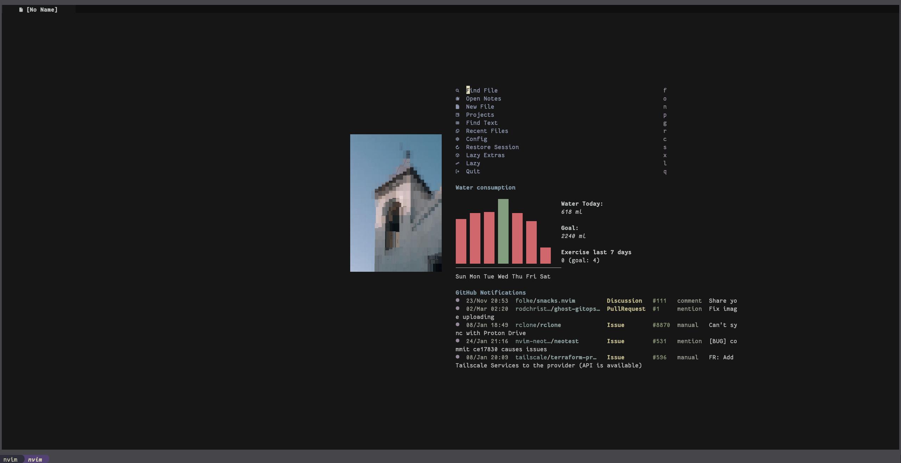

<!-- markdownlint-disable MD013 -->
# Maisievim



My own configuration used to set up Neovim with [LazyVim](https://www.lazyvim.org/) plugins.

## Structure

```
vim/.config/nvim
├── after
│   ├── lsp
│   │   ├── Settings for all of the LSPs I use.
│   └── plugin
│       └── Setting up autocmds, _after_ my plugins are loaded.
├── lazyvim.json <-- Where extra sets of plugins are referenced.
├── lua
│   ├── config
│   │   ├── autocmds.lua <-- Autocmds run during lazyvim setup
│   │   ├── keymaps.lua <-- custom keymapping
│   │   ├── lazy.lua <-- Lazy.nvim setup
│   │   └── options.lua <-- Glboal options, filetype mappings
│   ├── lsp.lua <-- Global LSP setup + keymaps
│   ├── plugins <-- Lazy.nvim plugin specs
│   │   ├── astro.lua <-- Extra setup for `Astro.build`
│   │   ├── bigquery.lua <-- Google BigQuery support
│   │   ├── coding.lua <-- Plugins for navigating + writing code
│   │   ├── colorscheme.lua <-- Color schemes installed
│   │   ├── core.lua <-- LazyVim plugin settings
│   │   ├── dashboard-home.lua <-- Dashboard at home
│   │   ├── dashboard-monzo.lua <-- Dashboard at work
│   │   ├── editor.lua <-- Nice editor plugins
│   │   ├── go.lua <-- Disables nvim-lint for Go files (use LSP)
│   │   ├── lazydev.lua <-- Type completion for lua plugins
│   │   ├── lsp.lua <-- Install LSPs via Mason
│   │   ├── lualine.lua <-- Cool status bar
│   │   ├── markdown.lua <-- Pretty notes experience
│   │   ├── mdx.lua <-- Parse MDX as markdown
│   │   ├── monzo.lua <-- Some old work stuff, no longer used
│   │   ├── music.lua <-- YT-music in the terminal
│   │   ├── noice.lua <-- Custom notification views
│   │   ├── none-ls.lua <-- Non-LSP diagnostics (semgrep etc)
│   │   ├── obsidian.lua <-- Obsidian notes navigation
│   │   ├── octo.lua <-- GitHub, in the editor.
│   │   ├── python.lua <-- Python plugins + formatter
│   │   ├── quarto.lua <-- Jupyter in neovim? You bet.
│   │   ├── snacks.lua <-- Pickers and inline images!
│   │   ├── sql.lua <-- Database suport
│   │   └── ui.lua <-- Visual changes
│   └── util.lua <-- Utilities for conditional config
├── queries
│   └── markdown
│       ├── highlights.scm <-- TK + "@import" support.
│       ├── injections.scm <-- Typescript-in-markdown
│       └── textobjects.scm <-- Jump between Jupyter cells
├── stylua.toml <-- Lua formatting.
└── wallpaper.jpg <-- Start screen wallpaper

9 directories, 61 files
```

## Installation

You can install this alongside your current Neovim config:

* Copy this directory to `~/.config/maisievim`
* `NVIM_APPNAME=maisievim nvim`
* Open `nvim` and let Lazy install.
* ???
* Profit

## Key bindings

`which-key.nvim` should help with finding most of these. `;` or `<space>` will trigger the popup, or just by running `:WhichKey`

`;qd` in an SQL file will send your query to BigQuery and return an estimate of how much data will be used.

`;q` also has some useful commands for running Jupyter notebooks, via `jupytext` and `molten`. Notebooks will take the form of a markdown file automatically.
